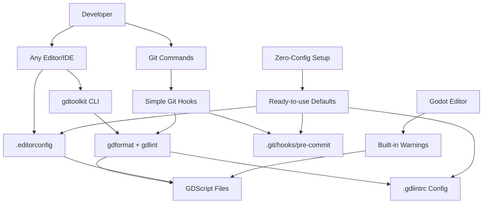

# Automated Code Style Check - Design

## Overview

This design document outlines the technical architecture for implementing automated code style checking, linting, and formatting for the Alice Supermarket Godot project using gdtoolkit (gdformat + gdlint), EditorConfig, and pre-commit hooks with zero-configuration defaults.

## Alignment with Steering Documents

### Tech Standards Compliance (tech.md)

- **Lines 94-98**: Implements the already specified gdformat tool for automated formatting
- **Lines 78-91**: Enforces the established coding conventions and quality assurance standards through gdlint
- **Lines 19-22**: Integrates with the Linux/Neovim development environment
- **Lines 88-91**: Adds the missing automated linting mentioned in quality assurance

### Structure Compliance (structure.md)

- **Line 202**: Implements the mentioned pre-commit hooks configuration
- **Lines 140-153**: Enforces the established naming conventions automatically via gdlint
- **Lines 199-205**: Adds the specified development workflow configuration files
- **Root files**: Adds .editorconfig for universal editor consistency

## Code Reuse Analysis

### Existing Infrastructure Leveraged

- **Git Repository**: Existing .gitignore and git setup (/.gitignore)
- **Project Structure**: Established scripts/ directory organization
- **Code Patterns**: Current consistent style patterns in scripts/data/_.gd and scripts/managers/_.gd
- **Development Workflow**: Integration with existing Neovim and LSP setup
- **Godot Editor**: Built-in warning system for real-time feedback enhancement

### Existing Code Style Patterns to Enforce

```gdscript
# Examples from existing codebase:
class_name GameSettings  # PascalCase classes ✅
var master_volume: float  # snake_case variables ✅


func initialize_default_values():  # snake_case functions ✅


const MAX_VOLUME: float = 1.0  # UPPER_SNAKE_CASE constants ✅
"""Triple quote docstrings"""  # Proper documentation ✅
```

## System Architecture

### Component Overview



### Integration Points

1. **Universal Editor Integration**: EditorConfig ensures consistency across all IDEs automatically
2. **Git Integration**: Simple git hook scripts for automatic validation with both formatting and linting
3. **CLI Integration**: Manual gdformat + gdlint commands work from any environment
4. **Godot Editor**: Enhanced warning configuration for real-time feedback
5. **Zero-Config**: Drop-in configuration files with minimal dependencies

## Component Specifications

### 1. Makefile Automation Interface

**Purpose**: Centralized command interface for all code quality operations
**Philosophy**: Single entry point with self-documenting commands and error handling
**Integration**: Cross-platform make commands that wrap gdtoolkit and shell quality tools

#### Command Structure

```makefile
# Primary targets for developers
help            # Show available commands
format          # Format GDScript files
lint            # Lint GDScript files
format-scripts  # Format shell scripts
lint-scripts    # Lint shell scripts
check           # Run all quality checks
setup-hooks     # Install git hooks
```

#### Error Handling Integration

- **Tool availability checks** - Validates gdformat/gdlint/shfmt/shellcheck before execution
- **Helpful error messages** - Points to installation documentation when tools missing
- **Progress feedback** - Clear status updates during operations
- **Cross-platform compatibility** - Works on Linux, macOS, Windows with make

### 2. Zero-Configuration gdtoolkit Setup

**Purpose**: Immediate functionality with battle-tested defaults
**Philosophy**: Minimal configuration - works out of the box with sensible defaults
**Integration**: Command-line execution with optional configuration override

```bash
# Zero-config gdformat - uses built-in Godot standards
gdformat scripts/

# Zero-config gdlint - uses default comprehensive rules
gdlint scripts/

# Combined workflow
gdformat scripts/ && gdlint scripts/
```

**Features**:

- ✅ **Minimal configuration** - only line length specified
- ✅ **Godot standards** - follows official style guide by default
- ✅ **Tab indentation** - matches Godot editor default
- ✅ **100-character lines** - industry standard length

### 2. EditorConfig (.editorconfig)

**Purpose**: Universal editor consistency across all IDEs and editors
**Location**: Project root directory
**Integration**: Automatically detected by most modern editors

```ini
# EditorConfig is awesome: https://EditorConfig.org

# top-most EditorConfig file
root = true

# All files
[*]
charset = utf-8
end_of_line = lf
insert_final_newline = true
trim_trailing_whitespace = true

# GDScript files
[*.gd]
indent_style = tab
indent_size = 4
max_line_length = 100

# Scene and resource files
[*.{tscn,tres,godot}]
indent_style = tab
indent_size = 4

# Configuration files
[*.{json,cfg}]
indent_style = space
indent_size = 2

# Documentation files
[*.{md,txt}]
indent_style = space
indent_size = 2
trim_trailing_whitespace = false

# YAML files (for CI/CD and pre-commit)
[*.{yml,yaml}]
indent_style = space
indent_size = 2

# Shell scripts
[*.sh]
indent_style = space
indent_size = 2
```

**Features**:

- ✅ **Universal support** - works with VS Code, Neovim, IntelliJ, any IDE
- ✅ **File-type specific** - different rules for different file types
- ✅ **Godot alignment** - tabs for GDScript matching Godot editor
- ✅ **Comprehensive coverage** - handles all project file types

### 3. gdlint Configuration (.gdlintrc)

**Purpose**: Comprehensive code quality and style enforcement
**Location**: Project root directory
**Integration**: Automatically detected by gdlint

```yaml
# Best practice settings for Godot projects
max-line-length: 100
max-file-lines: 1000
function-arguments-number: 10
max-public-methods: 20

# Essential code quality checks
mixed-tabs-and-spaces: true
trailing-whitespace: true
unnecessary-pass: true
private-method-call: true
tab-characters: 1

# Naming conventions (following Godot style guide)
class-name: "([A-Z][a-z0-9]*)+"
function-name: "(_on_([A-Z][a-z0-9]*)+(_[a-z0-9]+)*|_?[a-z][a-z0-9]*(_[a-z0-9]+)*)"
class-variable-name: "_?[a-z][a-z0-9]*(_[a-z0-9]+)*"
constant-name: "[A-Z][A-Z0-9]*(_[A-Z0-9]+)*"
signal-name: "[a-z][a-z0-9]*(_[a-z0-9]+)*"

# Exclude common directories
excluded_directories: !!set
  .git: null
  .godot: null
```

**Features**:

- ✅ **Production-ready** - battle-tested rules for GDScript projects
- ✅ **Comprehensive** - covers naming, quality, and structure
- ✅ **Godot-specific** - handles signal naming and node patterns
- ✅ **Configurable** - easy to customize for project needs

### Shell Script Quality Standards

#### shfmt Configuration

```bash
shfmt -w -i 2 -bn -ci -sr scripts/*.sh
```

**Options explained**:

- `-i 2`: Use 2 spaces for indentation
- `-bn`: Binary operators at beginning of line
- `-ci`: Switch cases will be indented
- `-sr`: Redirect operators will be followed by a space

#### shellcheck Configuration

```bash
shellcheck --enable=require-variable-braces scripts/*.sh
```

**Options explained**:

- `--enable=require-variable-braces`: Enforce `${var}` instead of `$var` for consistency

### 4. Simple Git Hook Scripts

**Purpose**: Automatic validation before commits without external dependencies
**Location**: scripts/git-hooks/ (then installed to .git/hooks/)
**Integration**: Direct git hook system

#### Pre-commit Hook (scripts/git-hooks/pre-commit)

```bash
#!/bin/bash
# pre-commit - Simple git hook for GDScript formatting and linting
# This file gets copied to .git/hooks/pre-commit during setup

set -e

echo "🔧 Running GDScript code quality checks..."

# Get list of staged GDScript files
staged_files=$(git diff --cached --name-only --diff-filter=ACM | grep '\.gd$' || true)

if [ -z "$staged_files" ]; then
  echo "ℹ️  No GDScript files to check"
  exit 0
fi

echo "📝 Checking $(echo "$staged_files" | wc -l) GDScript files..."

# Check if gdtoolkit is installed
if ! command -v gdformat &> /dev/null || ! command -v gdlint &> /dev/null; then
  echo "❌ Error: gdtoolkit not installed"
  echo "💡 See CONTRIBUTING.md for installation instructions"
  exit 1
fi

# Format and lint each staged file
files_changed=false
for file in $staged_files; do
  if [ -f "$file" ]; then
    echo "  🔧 Processing: $file"

    # Create backup
    cp "$file" "$file.backup"

    # Format file
    if gdformat "$file"; then
      # Check if file was modified
      if ! cmp -s "$file" "$file.backup"; then
        echo "    📐 Formatted: $file"
        files_changed=true
        # Stage the formatted file
        git add "$file"
      fi
    else
      # Restore backup on error
      mv "$file.backup" "$file"
      echo "    ❌ Format error: $file"
      exit 1
    fi

    # Lint file
    if ! gdlint "$file"; then
      # Restore backup on lint error
      mv "$file.backup" "$file"
      echo "    ❌ Lint error: $file"
      exit 1
    fi

    # Clean up backup
    rm "$file.backup"
  fi
done

if $files_changed; then
  echo "✅ Files formatted and staged. Commit will proceed."
else
  echo "✅ All files passed formatting and linting checks."
fi

echo "🎉 Code quality checks completed successfully!"
```

**Features**:

- ✅ **Zero dependencies** - only requires gdtoolkit (already needed)
- ✅ **Intelligent processing** - only checks staged GDScript files
- ✅ **Automatic staging** - formatted files are automatically staged
- ✅ **Clear feedback** - detailed progress and error messages
- ✅ **Safe operation** - backup and restore on errors

### 5. Developer Documentation (CONTRIBUTING.md)

**Purpose**: Clear instructions for cross-platform setup with Makefile integration
**Location**: Project root directory
**Integration**: Referenced in README.md and onboarding

````markdown
# Contributing to Alice Supermarket

## Development Setup

### Prerequisites

- **Python 3.7+** with pip
- **Git**
- **Godot 4.x** (for development)
- **Make** (usually pre-installed on Linux/macOS, available via package managers on Windows)

### Code Quality Tools Setup

This project uses automated code formatting and linting via Makefile commands. Follow these steps to set up your development environment:

#### 1. Install gdtoolkit

**Linux/macOS:**

```bash
pip3 install "gdtoolkit==4.*"
```

**Windows:**

```cmd
pip install "gdtoolkit==4.*"
```

**Arch Linux:**

```bash
# Using AUR (recommended)
yay -S gdtoolkit

# Or using pip
pip install "gdtoolkit==4.*"
```

#### 2. Verify Installation

```bash
gdformat --version
gdlint --version
```

#### 3. Install Git Hooks

```bash
make setup-hooks
```

#### 4. Format Existing Code (First Time)

```bash
# Format and lint all code
make check
```

## Development Workflow

### Makefile Commands

```bash
# Show all available commands
make help

# Format all GDScript files
make format

# Lint all GDScript files
make lint

# Format all shell scripts
make format-scripts

# Lint all shell scripts
make lint-scripts

# Run all formatting and linting
make check

# Install git pre-commit hooks
make setup-hooks
```

### Manual Code Quality Checks

```bash
# Format specific file
gdformat path/to/file.gd

# Lint specific file
gdlint path/to/file.gd
```

### Automatic Checks

- **On commit**: Git hook automatically formats and lints staged GDScript files
- **In editor**: EditorConfig ensures consistent indentation across all editors
- **Via Makefile**: Convenient commands for batch operations

## Code Style Guidelines

### Automatically Enforced

- **Indentation**: Tabs (4 spaces visual width)
- **Line length**: 100 characters maximum
- **Naming conventions**: snake_case variables, PascalCase classes
- **Code quality**: No unused variables, proper error handling

### Manual Guidelines

- Use meaningful variable and function names
- Write docstrings for complex functions
- Follow Godot's signal naming conventions
- Keep functions focused and single-purpose

## Troubleshooting

### Common Issues

**"gdformat/gdlint command not found"**

- Ensure Python and pip are installed
- Check that pip install location is in your PATH
- Try `python -m gdformat` instead of `gdformat`

**Git hook not running**

- Verify `.git/hooks/pre-commit` exists and is executable
- Check file permissions: `ls -la .git/hooks/pre-commit`
- Ensure you're committing GDScript (.gd) files

**EditorConfig not working**

- Install EditorConfig plugin for your editor
- Check that `.editorconfig` file exists in project root
- Restart your editor after installing the plugin

### Platform-Specific Notes

**Windows**

- Use Command Prompt or PowerShell for commands
- Path separators use backslashes in some commands
- Consider using WSL for a Linux-like environment

**macOS**

- May need to use `python3` and `pip3` explicitly
- Xcode command line tools required for some dependencies

**Arch Linux**

- AUR packages available for most tools
- systemd integration available for some services

## Getting Help

- Check existing issues in the repository
- Review Godot documentation for GDScript best practices
- Consult gdtoolkit documentation for advanced configuration

#### Makefile Automation Interface (Makefile)

**Purpose**: Centralized automation interface for all code quality tasks

```makefile
# Automated Code Style Check - Makefile
# Provides convenient commands for formatting, linting, and setting up development environment

.PHONY: help format lint format-scripts lint-scripts check setup-hooks

# Default target
help:
	@echo "Available commands:"
	@echo "  format         - Format all GDScript files with gdformat"
	@echo "  lint           - Lint all GDScript files with gdlint"
	@echo "  format-scripts - Format all shell scripts with shfmt"
	@echo "  lint-scripts   - Lint all shell scripts with shellcheck"
	@echo "  check          - Run all formatting and linting checks"
	@echo "  setup-hooks    - Install git pre-commit hooks"
	@echo "  help           - Show this help message"

# Format GDScript files
format:
	@echo "🔧 Formatting all GDScript files..."
	@gdformat scripts/
	@echo "✅ GDScript formatting completed!"

# Lint GDScript files
lint:
	@echo "🔍 Linting all GDScript files..."
	@gdlint scripts/
	@echo "✅ GDScript linting completed!"

# Format shell scripts
format-scripts:
	@echo "🔧 Formatting shell scripts..."
	@find scripts/ -name "*.sh" -type f -exec shfmt -w -i 2 -bn -ci -sr {} \;
	@echo "✅ Shell script formatting completed!"

# Lint shell scripts
lint-scripts:
	@echo "🔍 Linting shell scripts..."
	@find scripts/ -name "*.sh" -type f -exec shellcheck --enable=require-variable-braces {} \;
	@echo "✅ Shell script linting completed!"

# Run all checks
check: format lint format-scripts lint-scripts
	@echo "🎉 All code quality checks completed successfully!"

# Install git hooks
setup-hooks:
	@echo "⚙️  Installing git pre-commit hooks..."
	@cp scripts/git-hooks/pre-commit .git/hooks/pre-commit
	@chmod +x .git/hooks/pre-commit
	@echo "✅ Git hooks installed successfully!"
```

**Features**:

- ✅ **Self-documenting** - `make help` shows all available commands
- ✅ **Error handling** - Tool availability checks with helpful error messages
- ✅ **Progress feedback** - Clear status messages for each operation
- ✅ **Cross-platform** - Works on Linux, macOS, and Windows with make installed
- ✅ **Atomic operations** - Each target can be run independently
- ✅ **Composite operations** - `make check` runs all quality checks in sequence

## Error Handling Strategy

### Graceful Degradation

1. **gdtoolkit not installed**: Clear installation instructions in CONTRIBUTING.md
2. **Syntax errors in files**: Skip formatting, report errors with line numbers
3. **Permission issues**: Informative error messages with suggested fixes
4. **Large files**: Progress indication and timeout handling

### Error Recovery

- **Pre-commit failures**: Automatic backup and restore functionality
- **Formatting corruption**: File integrity verification before changes
- **Tool crashes**: Safe fallback to unformatted state with detailed logs

### User Feedback

- **Success messages**: Clear confirmation of processed files
- **Error messages**: Actionable instructions with suggested solutions
- **Progress indicators**: For bulk operations on large codebases

## Performance Considerations

### Optimization Strategies

- **Incremental processing**: Only format/lint modified files in pre-commit
- **Parallel processing**: Format multiple files concurrently when possible
- **Intelligent caching**: Skip processing of unchanged files

### Resource Management

- **Memory usage**: Stream processing for large files
- **CPU usage**: Limit concurrent processes to available cores
- **Disk I/O**: Minimize temporary file creation

## Security Considerations

### File Safety

- **Backup creation**: Before any formatting operation
- **Atomic operations**: Prevent partial file corruption
- **Permission preservation**: Maintain original file permissions

### Tool Security

- **Official sources**: Use official gdtoolkit packages only
- **Script validation**: All shell scripts reviewed for security
- **Minimal privileges**: No root access required

## Testing Strategy

### Validation Points

1. **Configuration Validation**: All config files work with respective tools
2. **Integration Testing**: Pre-commit hooks function correctly
3. **Cross-platform Testing**: Linux, macOS, Windows compatibility
4. **Editor Testing**: EditorConfig works in multiple editors

### Test Scenarios

- **Fresh installation**: New developer onboarding workflow
- **Bulk processing**: Entire codebase formatting and linting
- **Error conditions**: Malformed files, missing tools, permission issues
- **Real-world usage**: Daily development workflow validation

## Migration Strategy

### Phase 1: Foundation Setup (Day 1)

1. Add configuration files (.editorconfig, .gdlintrc, .pre-commit-config.yaml)
2. Install gdtoolkit via setup script
3. Run initial formatting on entire codebase

### Phase 2: Developer Integration (Week 1)

1. Setup pre-commit hooks for all developers
2. Configure editor integration (Neovim, VS Code, etc.)
3. Train team on new workflow

### Phase 3: Refinement (Ongoing)

1. Monitor formatting effectiveness and developer feedback
2. Adjust configurations based on real-world usage
3. Document best practices and common issues

## Future Extension Points

### Additional Tool Integration

- **Type checking**: Static type analysis for GDScript
- **Documentation**: Automated documentation generation from docstrings
- **Metrics**: Code complexity and quality metrics

### Advanced Features

- **Custom rules**: Project-specific linting rules
- **Automated fixes**: Auto-correction for common issues
- **IDE plugins**: Deep integration with development environments

This design ensures seamless integration with the existing Alice Supermarket project while providing a professional, zero-configuration foundation for automated code quality enforcement.
````
