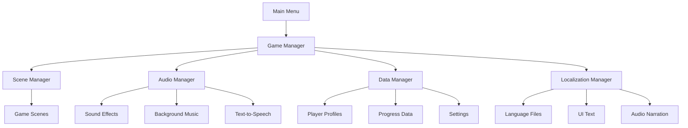

# Initial Foundation - Design

_Technical architecture and design for core foundation systems_

## Overview

This document outlines the design for foundational systems that will support educational gameplay in Alice Supermarket. The design leverages Godot 4.x architecture patterns and emphasizes simplicity, maintainability, and educational effectiveness.

## Architecture Overview



## Code Reuse Analysis

### Existing Foundation to Leverage

- **main_menu.gd**: Extend for enhanced navigation and profile selection
- **main_menu.tscn**: Base UI structure for consistent theming
- **project.godot**: Mobile configuration, input settings, rendering optimization
- **Asset folders**: Organized structure for graphics, audio, fonts, localization

### Integration Points

- Scene transitions from existing main menu buttons
- Asset loading from established folder structure
- Mobile input handling building on touch configuration

## Components and Interfaces

### 1. GameManager (Singleton)

**Purpose**: Central coordinator for all game systems
**File**: `scripts/managers/game_manager.gd`

```gdscript
extends Node

signal game_ready
signal scene_changed(scene_name: String)
signal player_profile_changed(profile: PlayerProfile)

var scene_manager: SceneManager
var audio_manager: AudioManager
var data_manager: DataManager
var localization_manager: LocalizationManager
var current_player: PlayerProfile

func initialize()
func get_manager(manager_name: String) -> Node
```

### 2. SceneManager (Singleton)

**Purpose**: Handle scene transitions with loading feedback
**File**: `scripts/managers/scene_manager.gd`

```gdscript
extends Node

signal scene_load_started(scene_path: String)
signal scene_load_progress(progress: float)
signal scene_load_completed(scene_name: String)
signal scene_load_failed(scene_path: String, error: String)

func change_scene(scene_path: String, transition_type: String = "fade")
func preload_scene(scene_path: String)
func get_current_scene_name() -> String
```

### 3. AudioManager (Singleton)

**Purpose**: Centralized audio control with educational features
**File**: `scripts/managers/audio_manager.gd`

```gdscript
extends Node

signal audio_settings_changed()

var master_volume: float
var sfx_volume: float
var music_volume: float
var tts_enabled: bool

func play_sfx(sound_name: String, volume_override: float = -1.0)
func play_music(track_name: String, fade_in: bool = true)
func speak_text(text: String, language: String = "")
func stop_all_audio()
```

### 4. DataManager (Singleton)

**Purpose**: Player data persistence and progress tracking
**File**: `scripts/managers/data_manager.gd`

```gdscript
extends Node

signal data_saved()
signal data_loaded()
signal profile_created(profile: PlayerProfile)

func save_player_data(profile: PlayerProfile)
func load_player_data(profile_id: String) -> PlayerProfile
func create_new_profile(name: String, avatar: String, language: String) -> PlayerProfile
func get_all_profiles() -> Array[PlayerProfile]
func delete_profile(profile_id: String)
```

### 5. LocalizationManager (Singleton)

**Purpose**: Multi-language support with fallbacks
**File**: `scripts/managers/localization_manager.gd`

```gdscript
extends Node

signal language_changed(new_language: String)

var current_language: String
var supported_languages: Array[String] = ["en", "sv"]

func set_language(language_code: String)
func get_text(key: String, fallback: String = "") -> String
func get_audio_path(key: String, language: String = "") -> String
func is_language_supported(language_code: String) -> bool
```

## Data Models

### PlayerProfile

**File**: `scripts/data/player_profile.gd`

```gdscript
class_name PlayerProfile
extends Resource

@export var id: String
@export var name: String
@export var avatar: String
@export var language: String
@export var created_date: String
@export var last_played: String
@export var settings: Dictionary
@export var progress: ProgressData
```

### ProgressData

**File**: `scripts/data/progress_data.gd`

```gdscript
class_name ProgressData
extends Resource

@export var math_level: int
@export var reading_level: int
@export var writing_level: int
@export var total_play_time: float
@export var achievements: Array[String]
@export var completed_activities: Dictionary
```

### GameSettings

**File**: `scripts/data/game_settings.gd`

```gdscript
class_name GameSettings
extends Resource

@export var master_volume: float = 1.0
@export var sfx_volume: float = 1.0
@export var music_volume: float = 0.7
@export var tts_enabled: bool = true
@export var language: String = "en"
@export var accessibility_mode: bool = false
```

## Error Handling Strategy

### Graceful Degradation

- Audio failures: Continue without sound, show audio disabled indicator
- Localization failures: Fall back to English with error logging
- Save failures: Retry with exponential backoff, warn user if persistent
- Scene load failures: Return to main menu with user-friendly error message

### Logging System

```gdscript
# Use Godot's built-in logging with custom categories
func log_error(category: String, message: String, details: Dictionary = {}):
    print_rich("[color=red][ERROR][/color] [%s] %s" % [category, message])
    if details:
        print("Details: ", details)
```

## Testing Strategy

### Unit Testing Approach

- Manager classes: Test initialization, state changes, error conditions
- Data models: Test serialization, validation, edge cases
- Scene transitions: Test loading, unloading, memory management

### Integration Testing

- Cross-manager communication: Test event flow between systems
- Data persistence: Test save/load cycles with various data states
- Localization: Test language switching with different content types

### Mobile Testing

- Touch input: Test on various screen sizes and orientations
- Performance: Profile memory usage and frame rates on target devices
- Audio: Test with device audio settings and interruptions

## Implementation Phases

### Phase 1: Core Managers

- Implement GameManager as central coordinator
- Create basic SceneManager with simple transitions
- Set up DataManager with file I/O operations

### Phase 2: Enhanced Features

- Add AudioManager with SFX and music support
- Implement LocalizationManager with Swedish/English support
- Create PlayerProfile and ProgressData classes

### Phase 3: Integration & Polish

- Connect all managers through GameManager
- Add error handling and recovery mechanisms
- Implement settings persistence and validation

### Phase 4: Mobile Optimization

- Add touch-friendly UI components
- Optimize asset loading for mobile devices
- Test and refine on target Android devices

## File Organization

```
scripts/
├── managers/
│   ├── game_manager.gd
│   ├── scene_manager.gd
│   ├── audio_manager.gd
│   ├── data_manager.gd
│   └── localization_manager.gd
├── data/
│   ├── player_profile.gd
│   ├── progress_data.gd
│   └── game_settings.gd
├── ui/
│   ├── base_ui.gd
│   └── loading_screen.gd
└── utils/
    ├── file_utils.gd
    └── device_utils.gd
```

This design provides a solid foundation for educational game development while maintaining code quality and scalability for future features.
